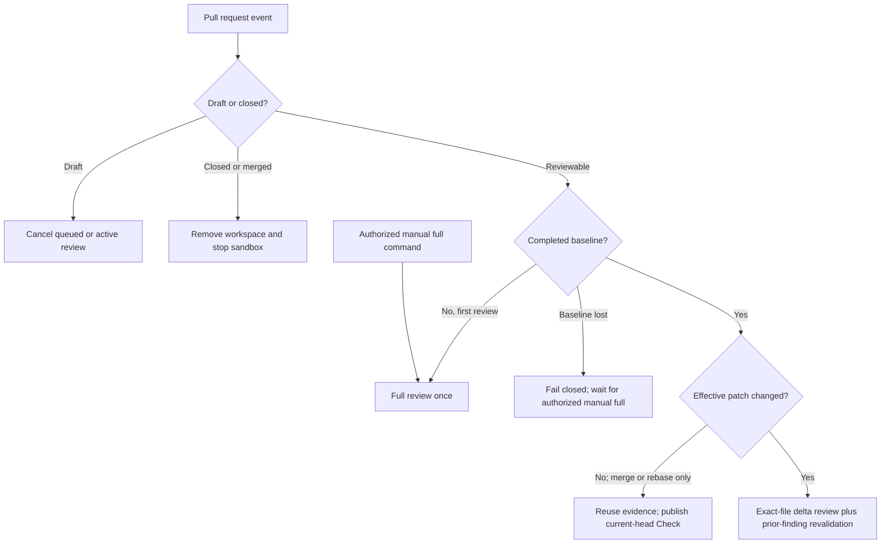

# known-good-review

`known-good-review` is a review-only GitHub App built as a standalone Eve
application. It runs on Vercel, uses Vercel AI Gateway for models, inspects pull
requests inside Vercel Sandbox, receives GitHub App events through Eve's native
GitHub channel, and publishes aggregate and per-axis Checks, one visible result
summary, and stable inline finding threads through the official Chat SDK GitHub
adapter's typed Octokit surface.

## Lifecycle

The paths below are exclusive. A full review and a delta review never run in
parallel for the same event.



- A reviewable PR opened from the outset gets a trailing 10-minute debounce.
- A draft becoming ready starts its first full review immediately.
- New commits during the debounce reset it. A new event steers and cancels
  stale active Eve work.
- After the first successful full review, only semantic delta files are freshly
  reviewed. Every open Blocking/Important finding and relevant Improvement or
  Nitpick is revalidated; other presentation-only findings are carried forward.
- Merge and rebase SHA churn is compared by normalized effective patch. A
  semantic no-op does not call a model and does not start another review; it
  only creates or updates the required Check on the current head.
- A missing, malformed, or failed baseline never triggers an automatic
  replacement full review. A write/maintain/admin user can explicitly request
  one with `@known-good-review run full review`.

One visible GitHub summary comment also holds the hidden authoritative versioned
review state and complete v2 findings artifact. Convex stores advisory,
repository-scoped cross-PR memory
through `@convex-dev/rag`; it never owns the current verdict, baseline, or
finding status. Recent matches remain individual while older matches collapse
to bounded semantic-cluster representatives after the repository has enough
review history. The GitHub state allows the next webhook to distinguish the
first review, an exact delta, a semantic no-op, and a lost baseline.

## Trusted repository configuration

The only optional configuration is `.github/known-good-review.yml`. The app
reads it from the pull request's base commit SHA, never from the proposed head.
Unknown keys or models fail closed.

```yaml
model: openai/gpt-5.6-sol
agents: moonshotai/kimi-k3
profile: balanced
blocking: false
embedding: voyage/voyage-4
embeddingDimension: 1024
publicRoots:
  - website
```

`model` defaults to this ordered AI Gateway fallback chain:

- `openai/gpt-5.6-sol`
- `moonshotai/kimi-k3`
- `anthropic/claude-opus-5`

Any currently listed AI Gateway language model with tool use is accepted;
there is no model allowlist. Comma-separated IDs form an ordered fallback
chain. `agents` is optional: a string applies one chain to every subagent,
while a mapping can override exact `code-review` axes without creating a
second lane system. `scout` and `commenter` default to
`openai/gpt-5.6-luna` with xhigh reasoning and can be overridden like the axes:

```yaml
model: openai/gpt-5.6-sol, anthropic/claude-opus-5
agents:
  deduplication: moonshotai/kimi-k3, openai/gpt-5.6-sol
  claim-and-specification: anthropic/claude-opus-5
  engineering-quality: openai/gpt-5.6-sol
  discoverability: moonshotai/kimi-k3
  scout: openai/gpt-5.6-luna
  commenter: openai/gpt-5.6-luna
```

`profile` changes inline publication volume without changing review depth or
the canonical report. `focused` publishes Blocking and Important findings,
`balanced` also publishes Improvements, and `thorough` also publishes
Nitpicks. The default is `balanced`. Hidden Nitpicks remain visible in counts,
revalidation, telemetry, and repository memory.

Reviews are non-blocking by default. Set `blocking: true` to submit GitHub
`REQUEST_CHANGES` when an open Blocking or Important finding exists and
`APPROVE` otherwise. Improvements and Nitpicks never block.

`embedding` accepts any currently listed AI Gateway embedding model.
`embeddingDimension` must match that model's default output and one of Convex
RAG's supported vector sizes. The defaults are `voyage/voyage-4` and 1024.
Changing either value re-embeds the repository in a parallel namespace and
promotes it only after the replacement is ready.

`publicRoots` declares repository-relative public-content trees from the
trusted base. Discoverability also activates for explicit website, SEO,
landing, blog, legal, robots, sitemap, social-image, favicon, and icon paths.
Generic framework pages, API routes, schemas, manifests, and docs do not imply
publicness.

The coordinator and each invocation use one successful model. AI Gateway tries
only the explicitly listed fallbacks when the primary fails. Revalidation uses
the scalar `agents` chain when present; a per-axis map leaves revalidation on
the coordinator chain.

Each active review axis receives its own Check Run. Axis Checks report
execution health only: in progress while working, success after complete
evidence coverage, skipped when a conditional axis does not apply, and
action-required when an active axis cannot complete. The aggregate Check owns
the configured blocking policy.

## Local development

Requirements are Bun 1.3.14 and the runtime prerequisites selected by Eve's
local sandbox backend. The project intentionally uses Bun for installs, scripts,
tests, and builds. Node 24 remains the deployment engine because that is the
current Eve/Vercel runtime contract.

```bash
bun install
bunx convex dev
bun run check
bun run dev
```

`bun run check` type-checks, runs the deterministic unit suite, inspects Eve's
discovered surface, and builds without provisioning a hosted sandbox snapshot.
It does not call a paid model. Convex code is also type-checked locally; a
Convex deployment is needed only to regenerate bindings or exercise HTTP
actions.

The production sandbox has GitHub-only egress, no repository credentials, and
one persistent Eve sandbox per PR session. Eve stops compute after each turn
while retaining the filesystem for later deltas. Close/merge cleanup removes
the inspected workspace before stopping it. Physical retention after stop is
owned by Vercel Sandbox; Eve's public runtime handle deliberately exposes
`stop()`, not a provider sandbox identifier that application code could safely
delete.

## External setup

Provision the Connect-backed GitHub App with Eve's current setup flow, create
the Convex deployment, deploy the app to Vercel, and install it on selected
repositories. Give Convex its AI Gateway key and
the shared memory bearer token; give Eve the Convex HTTP-actions URL and the
same token. The app needs repository metadata read, contents read, pull
requests read/write, issues read/write, and checks read/write. Forward
`pull_request`, `issue_comment`, `installation`, and
`installation_repositories` events through Connect to `/eve/v1/github`.

The single GitHub route verifies installation lifecycle events with the same
Connect OIDC verifier as Eve. Exact repository removals delete memory by
immutable GitHub repository node ID. A complete uninstall deletes every
repository remembered for that installation; the installation association is
cleanup metadata and never becomes the memory namespace. The authenticated
Convex `/memory/delete` endpoint accepts the cleanup before the webhook is
acknowledged, then performs bounded, retrying, race-safe namespace deletion.
When GitHub reports an all-to-selected access change with an empty removal
list, the route reconciles memory against the repositories still accessible to
the installation.

Do not add a second Chat SDK webhook route. The decorated Eve route owns inbound
verification, lifecycle cleanup, durable PR sessions, checkout, and steering.
The Chat SDK adapter is the typed outbound publication boundary for Check Runs,
the result summary, inline finding threads, and the rare
installation-reconciliation API read.

See [architecture](docs/architecture.md), [domain context](CONTEXT.md), and
[skill provenance](docs/skill-provenance.md).
