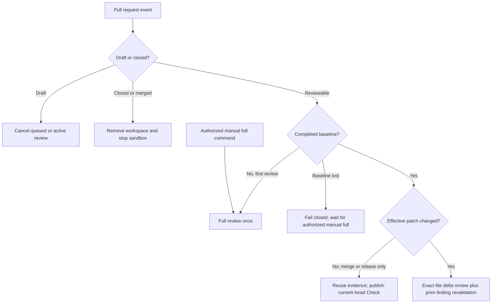

# known-good-review

`known-good-review` is a review-only GitHub App built as a standalone Eve
application. It runs on Vercel, uses Vercel AI Gateway for models, inspects pull
requests inside Vercel Sandbox, receives GitHub App events through Eve's native
GitHub channel, and publishes one Check Run plus stable finding comments through
the official Chat SDK GitHub adapter's typed Octokit surface.

This repository is a local scaffold. No GitHub App, Vercel project, Connect
connector, deployment, package, or other external resource has been created.

## Lifecycle

The paths below are exclusive. A full review and a delta review never run in
parallel for the same event.



- A reviewable PR opened from the outset gets a trailing 10-minute debounce.
- A draft becoming ready starts its first full review immediately.
- New commits during the debounce reset it. A new event steers and cancels
  stale active Eve work.
- After the first successful full review, only semantic delta files are freshly
  reviewed. Every open Blocking/Important finding and relevant Improvement is
  revalidated; other Improvements are carried forward.
- Merge and rebase SHA churn is compared by normalized effective patch. A
  semantic no-op does not call a model and does not start another review; it
  only creates or updates the required Check on the current head.
- A missing, malformed, or failed baseline never triggers an automatic
  replacement full review. A write/maintain/admin user can explicitly request
  one with `@known-good-review run full review`.

GitHub comments hold the versioned review state and complete v2 findings
artifact. There is no application database. The state allows the next webhook
to distinguish the first review, an exact delta, a semantic no-op, and a lost
baseline.

## Trusted repository configuration

The only optional configuration is `.github/known-good-review.yml`. The app
reads it from the pull request's base commit SHA, never from the proposed head.
Unknown keys or models fail closed.

```yaml
model: openai/gpt-5.6-sol
agents: moonshotai/kimi-k3
```

`model` defaults to `openai/gpt-5.6-sol`. Allowed model IDs are:

- `openai/gpt-5.6-sol`
- `anthropic/claude-opus-5`
- `moonshotai/kimi-k3`

Comma-separated IDs form an ordered AI Gateway fallback chain. `agents` is
optional: a string applies one chain to every subagent, while a mapping can
override exact `code-review` axes without creating a second lane system:

```yaml
model: openai/gpt-5.6-sol, anthropic/claude-opus-5
agents:
  deduplication: moonshotai/kimi-k3, openai/gpt-5.6-sol
  claim-and-specification: anthropic/claude-opus-5
  engineering-quality: openai/gpt-5.6-sol
  discoverability: moonshotai/kimi-k3
```

The coordinator and each invocation use one successful model. AI Gateway tries
only the explicitly listed fallbacks when the primary fails. Revalidation uses
the scalar `agents` chain when present; a per-axis map leaves revalidation on
the coordinator chain.

## Local development

Requirements are Bun 1.3.14 and the runtime prerequisites selected by Eve's
local sandbox backend. The project intentionally uses Bun for installs, scripts,
tests, and builds. Node 24 remains the deployment engine because that is the
current Eve/Vercel runtime contract.

```bash
bun install
bun run check
bun run dev
```

`bun run check` type-checks, runs the deterministic unit suite, inspects Eve's
discovered surface, and builds without provisioning a hosted sandbox snapshot.
It does not call a paid model.

The production sandbox has GitHub-only egress, no repository credentials, and
one persistent Eve sandbox per PR session. Eve stops compute after each turn
while retaining the filesystem for later deltas. Close/merge cleanup removes
the inspected workspace before stopping it. Physical retention after stop is
owned by Vercel Sandbox; Eve's public runtime handle deliberately exposes
`stop()`, not a provider sandbox identifier that application code could safely
delete.

## External setup not performed by this scaffold

When authorized later, provision the Connect-backed GitHub App with Eve's
current setup flow, deploy the app to Vercel, and install it on selected
repositories. The app needs repository metadata read, contents read, pull
requests read/write, issues read/write, and checks read/write. Subscribe to
`pull_request` and `issue_comment` events and route Connect to `/eve/v1/github`.

Do not add a second Chat SDK webhook route. Eve's GitHub channel owns inbound
verification, durable PR sessions, checkout, and steering. The Chat SDK adapter
is the typed outbound publication boundary for Check Runs and finding comments.

See [architecture](docs/architecture.md), [domain context](CONTEXT.md), and
[skill provenance](docs/skill-provenance.md).
