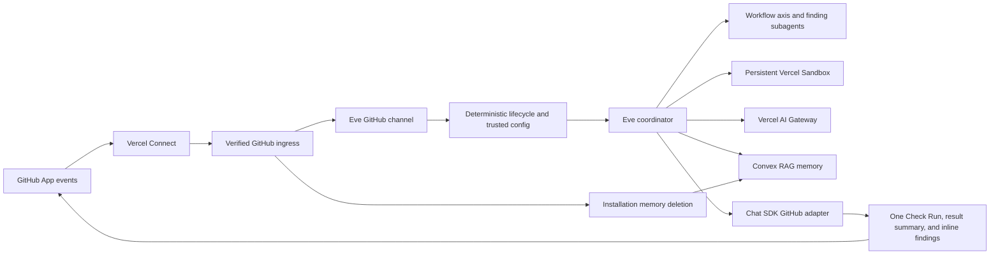

# Architecture

## Runtime boundaries

The native Eve GitHub route remains the only inbound webhook path. A thin route
decorator recognizes GitHub App installation lifecycle payloads, verifies them
with Eve's existing Connect OIDC verifier, and sends cleanup admission directly
to Convex. Every other request is delegated unchanged to Eve, which creates one
durable session per PR conversation, checks out the current PR without exposing
the installation token, and uses `steer` to cancel stale turns.

The official Chat SDK GitHub adapter is instantiated with the same Connect
connector and a webhook-specific installation ID. This application uses its
typed Octokit escape hatch because GitHub Checks are not a generic chat
operation. It does not register the adapter's webhook route.

## Admission and dispatch

Before a model can run, the channel fetches current PR metadata, reads config at
the base SHA, validates its closed schema, lists current PR files, decodes the
GitHub-owned baseline, computes the effective patch, and chooses exactly one
lifecycle plan. Invalid config and lost state create a failed Check directly.
Semantic no-ops reuse the prior v2 artifact directly. Neither path invokes a
model.

For model-backed paths, the channel writes the trusted base/head/config/plan
into Eve auth attributes and adds a review envelope to context. Publication
tools accept only a validated report; they never accept owner, repository, PR,
head, installation, or Check name as model input.

## Review execution

The coordinator loads the vendored `code-review` skill and maps active axes
one-to-one to Eve's built-in subagent. After the root revalidates the exact PR
head, an Eve `action.result` hook prepares the classified patch once in the
shared sandbox without putting preparation commands or raw patches in model
history. Lanes page an integrity-checked manifest and bounded patch chunks
instead of independently reconstructing the diff.
Child routing envelopes contain an exact skill axis or the `revalidation` role.
Dynamic model routing maps these roles directly to trusted `agents`
configuration.

AI Gateway receives the first model and its ordered `models` fallback array.
The Gateway generation lookup records the actual model and provider that
served the response, including when a fallback succeeded.

Every active axis is a fresh invocation. Claim-and-specification runs first
within its configured model group, then the remaining same-model axes run in
parallel. Eve and AI Gateway own automatic provider caching. Memory retrieval
occurs after the stable shared prefix and is advisory evidence that each axis
must revalidate against the current pull request.

Each lane writes one compact checkpoint before it returns. A complete
checkpoint owns the terminal worker report and prevents duplicate work; the
Workflow returns only completion receipts. An incomplete checkpoint records
reviewed and remaining manifest entry indexes, reproduced observations, next
steps, and limitations. The same native Eve Workflow can start a fresh built-in
subagent that reconciles that packet with the immutable manifest, without
inheriting the prior model history. This reuses the checkpoint-and-reconcile
semantics of Milestone Rush; it does not introduce another workflow runtime or
state service.

Eve compacts a lane at 25 percent of the selected model's context window. The
percentage adapts to arbitrary Gateway models while leaving enough room for a
large evidence chunk, related source, and probe output. Compaction and fresh
checkpoint continuation preserve review depth; neither is a completion gate.

## Repository memory

Successful full and delta publication queues an idempotent Convex ingestion;
publication never waits for embedding completion. Convex schedules bounded
retries and stores normalized outcomes in an `@convex-dev/rag` namespace keyed
by immutable GitHub repository ID. Prompts, patches, source, model responses,
credentials, and probe output are never stored.

Repositories start in bootstrap mode. Adaptive short, mid, and long tiers
activate only after the confirmed age, review-count, review-day, and span
gates. Retrieval post-ranks semantic matches by recency tier, severity, open
state, and distinct-PR recurrence. New memories reuse their one generated
embedding for both RAG storage and nearest-cluster assignment. Short-term
matches remain individual, mid-term retrieval keeps up to two representatives
per semantic cluster, and long-term retrieval keeps one. The clustering score
and tier caps live in the hashed memory policy for deterministic replay and
explicit tuning. A current review always owns the verdict.

An embedding-model change builds a pending RAG namespace while the active
namespace continues serving reads, then promotes the replacement atomically.
Each ingestion records its verified GitHub installation ID as cleanup metadata
while the namespace remains keyed only by immutable repository ID. Exact
repository-removal events delete the named node IDs. Complete uninstall sweeps
all remembered repositories for the installation in bounded pages. The
documented all-to-selected event with an empty removal list first enumerates the
installation's remaining accessible repositories and deletes the difference.
The authenticated deletion endpoint admits the work before the webhook is
acknowledged, then queues retrying deletion of every tracked RAG entry and
application record behind the in-flight-ingestion barrier.

## State and publication

An accepted model-backed review immediately creates or updates the current-head
Check Run as `in_progress`. Manual comment triggers receive Eve's native eyes
reaction. Completion moves the same Check Run to its final verdict.

Every successful publication also updates one visible PR summary containing the
result and a hidden canonical state schema v2 artifact, baseline head,
whole-patch fingerprint, and per-file fingerprints. Findings use native inline
review threads at their exact diff locations. Stable hidden `CR-N` markers own
reconciliation without exposing internal IDs. Findings absent from the current
canonical result are marked inactive. Check lookup is scoped to the current
head and the fixed name `known-good-review`.

The state artifact is size-bounded to GitHub's comment limit. Oversize or
invalid output fails before advancing the baseline. A completed or failed Eve
turn that did not publish a validated artifact becomes a failed Check; an
initial failure marks the baseline lost so a later webhook cannot silently run
a second full review.

## Sandbox and telemetry

The Vercel/microsandbox backends allow only GitHub domains and deny private
network ranges. Docker fallback is offline because it cannot broker per-domain
credentials. GitHub checkout authentication stays in the firewall; no token is
placed in the sandbox.

Sandbox bootstrap aligns `/workspace` ownership with the user that Eve actually
uses for commands, then verifies the result. The runtime revision key replaces
durable sandboxes when that contract changes instead of weakening Git's
ownership checks.

Each turn stops sandbox compute. The durable filesystem is resumed for the
next delta. A close/merge operation removes `/workspace` contents and stops the
sandbox. The GitHub state artifact remains so review history is auditable.

OpenTelemetry inputs and outputs are disabled. Eve emits its normal structural
run tags, while the metadata hook records Gateway generation model/provider,
tokens, cache tokens, exact USD cost, generation time, latency, outcome, and
review kind. Generation lookup failures are visible but do not expose prompts
or source.

Eve caps a root review session at 8,000,000 input tokens and 512,000 output
tokens. Exhaustion publishes an `action_required` Check with measured usage and
the configured cap, publishes no partial verdict, and never retries
automatically. Input telemetry also evaluates 2M, 3M, 4M, and 6M shadow caps.
